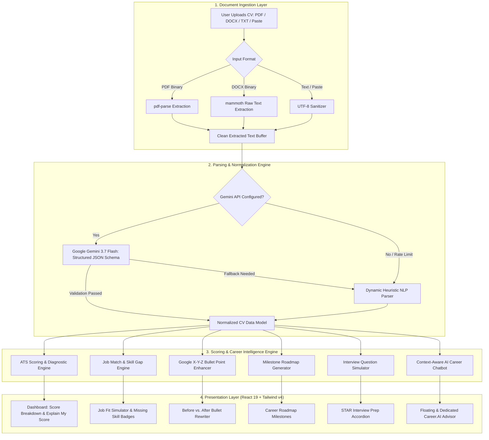

# 🚀 Smart CV Analyzer & Career Intelligence Platform (CAREER.AI)

<div align="center">


**منصة ذكية متكاملة لتحليل السيرة الذاتية (CV)، قياس التوافق مع أنظمة ATS، ومقارنتها بالوظائف المستهدفة مع خارطة طريق لتطوير المهارات وتحسين المحتوى بالذكاء الاصطناعي.**

*An enterprise-grade, AI-driven career intelligence engine powered by Google Gemini 3.7 Flash, React 19, Vite 6, and Express. Analyze resumes against modern Applicant Tracking Systems (ATS), simulate job acceptance probabilities, rewrite weak bullet points using Google's X-Y-Z formula, and generate tailored career roadmaps.*

---

[](https://nodejs.org/)
[](https://www.typescriptlang.org/)
[](https://react.dev/)
[](https://vitejs.dev/)
[](https://tailwindcss.com/)
[](https://ai.google.dev/)
[](https://expressjs.com/)
[](https://opensource.org/licenses/MIT)
[](https://github.com/MikeeeDeV/Smart-CV-Analyzer-Career-Intelligence-Platform/pulls)

[Live Demo / Overview](#project-overview--architecture) • [Core Features](#-core-features) • [Architecture Pipeline](#-architecture--pipeline) • [Tech Stack](#-tech-stack--libraries) • [Getting Started](#-local-setup--installation) • [API Reference](#-api-endpoints--walkthrough)

</div>

---

## 📖 Table of Contents

- [Project Overview & Architecture](#-project-overview--architecture)
- [Architecture & Pipeline](#-architecture--pipeline)
- [Core Features](#-core-features)
- [Tech Stack & Libraries](#-tech-stack--libraries)
- [Directory Structure](#-directory-structure)
- [Local Setup & Installation](#-local-setup--installation)
  - [Prerequisites](#prerequisites)
  - [Installation Steps](#step-by-step-installation)
  - [Environment Variables](#environment-variables-configuration)
- [Usage & API Walkthrough](#-api-endpoints--walkthrough)
  - [Running the Application](#running-the-application)
  - [REST API Reference](#rest-api-reference)
- [Key Modules Deep-Dive](#-key-modules-deep-dive)
- [Roadmap & Future Enhancements](#-roadmap--future-enhancements)
- [Contributing Guidelines](#-contributing-guidelines)
- [License](#-license)

---

## 🌟 Project Overview & Architecture

Modern recruitment relies heavily on **Applicant Tracking Systems (ATS)** that screen out up to 75% of candidate resumes before a human recruiter ever sees them. Common failure modes include non-parseable layouts, missing high-priority technical keywords, unquantified impact statements, and mismatched job descriptions.

**Smart CV Analyzer & Career Intelligence Platform (CAREER.AI)** resolves this problem space through a comprehensive, bilingual (Arabic / English) AI-powered ecosystem. Rather than offering basic keyword counting, CAREER.AI combines:

1. **Multi-Format Ingestion:** Instant client-side binary buffer encoding for `.pdf`, `.docx`, and `.txt` files with fallback raw text pasting.
2. **Dual-Engine Parser (Zero-Failure Resilience):**
   - **Primary Engine:** Google Gemini 3.7 Flash structured JSON extraction enforcing strict schema compliance.
   - **Secondary Engine:** High-performance dynamic heuristic NLP parser featuring multi-category regex dictionaries (60+ technical skills, frameworks, dev tools, and soft skills), candidate name verification against blacklisted header tokens, contact extraction, and experience bullet parsing.
3. **Multi-Dimensional ATS Scoring:** Detailed evaluation across 6 key axes: ATS parseability, content quality, skill density, experience impact, layout formatting, and portfolio strength.
4. **Interactive "What-If" Fit Simulator:** Dynamic scoring sandbox allowing candidates to simulate the impact of acquiring specific missing skills or adding quantified metrics, complete with instant score updates and celebratory feedback.
5. **Contextual Career Intelligence:** Automated roadmap generation, interview question generator tailored to probe candidate weaknesses, bullet point rewriting using Google's X-Y-Z formula, and a persistent AI Career Advisor chatbot.

---

## 📐 Architecture & Pipeline

### End-to-End Data Flow Diagram



### Text Processing & Parsing Strategy

```
Candidate File (PDF/DOCX/TXT)
  │
  ├──► Base64 Buffer Transfer via POST /api/cv/parse
  │     │
  │     ├──► [pdf-parse] -> Extract raw text streams from PDF objects
  │     └──► [mammoth]   -> Extract document XML text runs from DOCX
  │
  ▼
Clean Raw Text Buffer (UTF-8 filtered, binary control chars stripped)
  │
  ├──► [Primary Engine] Gemini 3.7 Flash JSON Mode
  │      └── Prompt: Strictly maps personal info, technical skills, frameworks,
  │                  tools, soft skills, structured experience, education, and projects.
  │
  └──► [Fallback Engine] Dynamic Heuristic NLP
         ├── Contact RegExp: Email, phone, LinkedIn, GitHub
         ├── Name Heuristics: Blacklist filtering (CV, Resume, Education, etc.)
         ├── Dictionary Tokenizer: 60+ curated software engineering keywords
         └── Experience Extractor: Bullet-point detection and normalization
```

---

## ✨ Core Features

| Feature | Description | Code Component |
| :--- | :--- | :--- |
| **Multi-Format Ingestion** | Upload `.pdf`, `.docx`, `.txt`, or paste raw resume text. Handles Base64 file buffers seamlessly. | [`UploadSection.tsx`](file:///home/mohamed-ayman/Documents/Smart-CV-Analyzer-Career-Intelligence-Platform/src/components/UploadSection.tsx) |
| **Dual-Engine CV Parsing** | Extracts structured candidate details (name, email, phone, links, skills, experience, education, projects) using Gemini 3.7 Flash with a zero-failure regex fallback. | [`server.ts`](file:///home/mohamed-ayman/Documents/Smart-CV-Analyzer-Career-Intelligence-Platform/server.ts#L70-L184) |
| **ATS Scoring & Diagnostics** | Comprehensive scoring (0-100) covering ATS compatibility, content quality, skill density, formatting, and project relevance. | [`CVScoreOverview.tsx`](file:///home/mohamed-ayman/Documents/Smart-CV-Analyzer-Career-Intelligence-Platform/src/components/CVScoreOverview.tsx) |
| **"Explain My Score" Modal** | Detailed diagnostic report disclosing keyword density, section completeness, action verb counts, strengths, and targeted improvement points. | [`CVScoreOverview.tsx`](file:///home/mohamed-ayman/Documents/Smart-CV-Analyzer-Career-Intelligence-Platform/src/components/CVScoreOverview.tsx#L20-L352) |
| **Targeted Job Matching** | Evaluates CV against preset tech roles (Frontend, React/Next.js, Full Stack, UI Engineer) or custom job descriptions to identify exact keyword overlaps. | [`JobMatchSection.tsx`](file:///home/mohamed-ayman/Documents/Smart-CV-Analyzer-Career-Intelligence-Platform/src/components/JobMatchSection.tsx) |
| **Interactive Fit Simulator** | "What-If" sandbox where candidates toggle missing skills, project work, or metrics to observe simulated ATS score jumps with confetti rewards. | [`JobFitSimulator.tsx`](file:///home/mohamed-ayman/Documents/Smart-CV-Analyzer-Career-Intelligence-Platform/src/components/JobFitSimulator.tsx) |
| **Google X-Y-Z Bullet Enhancer** | Transforms generic bullet points into metric-backed impact statements (*Accomplished [X], measured by [Y], by doing [Z]*) in both English and Arabic. | [`AIImprovementSection.tsx`](file:///home/mohamed-ayman/Documents/Smart-CV-Analyzer-Career-Intelligence-Platform/src/components/AIImprovementSection.tsx) |
| **Dynamic Career Roadmap** | Generates tailored learning milestones complete with estimated hours, target proficiency levels, recommended portfolio projects, and curated docs. | [`CareerRoadmapSection.tsx`](file:///home/mohamed-ayman/Documents/Smart-CV-Analyzer-Career-Intelligence-Platform/src/components/CareerRoadmapSection.tsx) |
| **Career Readiness Index** | Assesses career readiness across 5 distinct pillars (Skills, CV Quality, Experience, Projects, Certifications) and provides instant role recommendations. | [`CareerReadinessSection.tsx`](file:///home/mohamed-ayman/Documents/Smart-CV-Analyzer-Career-Intelligence-Platform/src/components/CareerReadinessSection.tsx) |
| **Smart Interview Prep** | Produces tailored technical, behavioral, and gap-probing interview questions with recruiter rationale and STAR answer blueprints. | [`InterviewPrepSection.tsx`](file:///home/mohamed-ayman/Documents/Smart-CV-Analyzer-Career-Intelligence-Platform/src/components/InterviewPrepSection.tsx) |
| **Contextual AI Career Advisor** | Full-context chatbot that answers questions based on the candidate's active CV, skill gaps, and target role in real time. Available as a dedicated view or floating launcher. | [`AIChatAssistant.tsx`](file:///home/mohamed-ayman/Documents/Smart-CV-Analyzer-Career-Intelligence-Platform/src/components/AIChatAssistant.tsx) |
| **Bilingual UI (Arabic & English)** | Native RTL/LTR support with typography customized via Google Fonts (`Cairo`, `Plus Jakarta Sans`, and `JetBrains Mono`). | [`Navbar.tsx`](file:///home/mohamed-ayman/Documents/Smart-CV-Analyzer-Career-Intelligence-Platform/src/components/Navbar.tsx) |
| **Instant Demo Profiles** | Pre-loaded candidate personas (Haneen Ahmed - Frontend Developer, Omar - Full Stack Developer) for one-click testing without uploading files. | [`sampleProfiles.ts`](file:///home/mohamed-ayman/Documents/Smart-CV-Analyzer-Career-Intelligence-Platform/src/data/sampleProfiles.ts) |

---

## 🛠 Tech Stack & Libraries

| Layer / Category | Technology / Package | Version | Purpose & Implementation Details |
| :--- | :--- | :--- | :--- |
| **Frontend Framework** | [React](https://react.dev/) | `^19.0.1` | Component-based UI with modern state management, concurrent rendering, and clean lifecycle hooks. |
| **Frontend Runtime** | [React DOM](https://react.dev/) | `^19.0.1` | DOM renderer for React 19 web applications. |
| **Build & Dev Server** | [Vite](https://vitejs.dev/) | `^6.2.3` | Ultra-fast HMR, optimized production bundling, and middleware integration with Express. |
| **Type System** | [TypeScript](https://www.typescriptlang.org/) | `~5.8.2` | Strict end-to-end type safety across backend endpoints and frontend data contracts. |
| **Styling & CSS** | [Tailwind CSS](https://tailwindcss.com/) | `^4.1.14` | Next-generation utility-first styling utilizing modern CSS layer architecture and `@tailwindcss/vite`. |
| **UI Iconography** | [Lucide React](https://lucide.dev/) | `^0.546.0` | Comprehensive icon library providing clean visual indicators for dashboard metrics, badges, and actions. |
| **Micro-Interactions** | [Motion (Framer)](https://motion.dev/) | `^12.23.24` | Fluid animations, tab transitions, progress meters, and reactive UI effects. |
| **Celebration Effects** | [Canvas Confetti](https://www.npmjs.com/package/canvas-confetti) | `^1.9.4` | Visual celebration triggers when candidate score reaches qualification milestones in the simulator. |
| **Backend Framework** | [Express](https://expressjs.com/) | `^4.21.2` | RESTful API server handling file uploads, JSON endpoints, and Vite middleware integration. |
| **Execution Engine** | [TSX](https://github.com/privatenumber/tsx) | `^4.21.0` | High-speed TypeScript execution engine for running `server.ts` directly in development without transpilation steps. |
| **Production Bundler** | [esbuild](https://esbuild.github.io/) | `^0.25.0` | Blazing-fast bundler compiling `server.ts` into a standalone Node CJS distribution file. |
| **AI / LLM Client** | [@google/genai](https://www.npmjs.com/package/@google/genai) | `^2.4.0` | Official Google Gen AI SDK utilizing `gemini-3.7-flash` for structured JSON extraction, scoring, and conversation. |
| **PDF Extraction** | [pdf-parse](https://www.npmjs.com/package/pdf-parse) | `^2.4.5` | Extracts clean raw textual streams from binary PDF files buffer-encoded from client uploads. |
| **DOCX Extraction** | [mammoth](https://www.npmjs.com/package/mammoth) | `^1.12.2` | Extracts unformatted raw textual runs from `.docx` files without requiring external word processing runtimes. |
| **Environment Config** | [dotenv](https://www.npmjs.com/package/dotenv) | `^17.2.3` | Manages environment configurations and loads `GEMINI_API_KEY` from local `.env` files. |

---

## 📂 Directory Structure

```plaintext
Smart-CV-Analyzer-Career-Intelligence-Platform/
├── .env.example                 # Environment variables configuration template
├── .gitignore                   # Git exclusion rules for node_modules, dist, and secrets
├── bun.lock                     # Bun dependency lockfile
├── index.html                   # HTML entry point with Cairo, Plus Jakarta Sans, and RTL setup
├── metadata.json                # Platform metadata, project description, and capabilities
├── package.json                 # Project dependencies, scripts, and build configuration
├── server.ts                    # Express server: Gemini client, PDF/DOCX extractors, REST APIs
├── tsconfig.json                # TypeScript compiler configuration (strict mode, JSX, bundler resolution)
├── vite.config.ts               # Vite build configuration with React & Tailwind v4 plugins
├── assets/                      # Static resources and AI Studio environment configs
└── src/
    ├── main.tsx                 # Client entry point mounting React 19 root
    ├── App.tsx                  # Master application controller: tabs, state synchronization, and modals
    ├── index.css                # Base stylesheet importing Tailwind CSS v4 and custom scrollbars
    ├── types.ts                 # Centralized TypeScript definitions (CVData, ScoreBreakdown, etc.)
    ├── data/
    │   └── sampleProfiles.ts    # Pre-configured demo profiles (Haneen Ahmed, Omar) & preset tech jobs
    └── components/
        ├── Navbar.tsx                   # Sticky navigation bar with RTL/LTR switch and mobile drawer
        ├── LandingHero.tsx              # Welcoming hero section with CTAs and instant demo loader
        ├── UploadSection.tsx            # Multi-format resume uploader (drag & drop, PDF/DOCX, raw paste)
        ├── CVScoreOverview.tsx          # 6-axis score dashboard and "Explain My Score" modal
        ├── ParsedCVViewer.tsx           # Interactive viewer/editor for extracted profile & skills
        ├── JobMatchSection.tsx          # Resume vs Job Description matcher & gap priority analyzer
        ├── JobFitSimulator.tsx          # "What-If" interactive score simulator with confetti celebrations
        ├── AIImprovementSection.tsx     # Google X-Y-Z formula AI bullet point & project rewriter
        ├── CareerReadinessSection.tsx   # 5-pillar career readiness evaluation & recommended roles
        ├── CareerRoadmapSection.tsx     # Milestone learning roadmap with hours & project targets
        ├── InterviewPrepSection.tsx     # Role-specific technical & behavioral interview question generator
        └── AIChatAssistant.tsx          # Context-aware conversational AI Career Advisor (modal & full tab)
```

---

## 🚀 Local Setup & Installation

### Prerequisites

Ensure you have the following installed on your development machine:
- **Node.js**: `v18.0.0` or higher (`v20.x` LTS recommended). Verify using:
  ```bash
  node -v
  ```
- **Package Manager**: `npm` (`v9+`), `pnpm`, or `bun`.
- **Google Gemini API Key**: Obtain a free API key from [Google AI Studio](https://aistudio.google.com/).

---

### Step-by-Step Installation

1. **Clone the Repository:**
   ```bash
   git clone https://github.com/MikeeeDeV/Smart-CV-Analyzer-Career-Intelligence-Platform.git
   cd Smart-CV-Analyzer-Career-Intelligence-Platform
   ```

2. **Install Dependencies:**
   Using `npm`:
   ```bash
   npm install
   ```
   *Or using `bun`:*
   ```bash
   bun install
   ```

3. **Configure Environment Variables:**
   Copy the `.env.example` template to create your `.env` file:
   ```bash
   cp .env.example .env
   ```

4. **Add Your Gemini API Key:**
   Open `.env` in your preferred editor and insert your Gemini API Key:
   ```env
   GEMINI_API_KEY="AIzaSyYourActualGeminiApiKeyHere"
   PORT=3000
   NODE_ENV=development
   ```

5. **Start the Development Server:**
   ```bash
   npm run dev
   ```

6. **Open the Application:**
   Navigate to [http://localhost:3000](http://localhost:3000) in your browser. The Vite dev server will bundle and serve the frontend while Express handles the API requests simultaneously.

---

### Environment Variables Configuration

| Variable | Required | Default | Description |
| :--- | :---: | :---: | :--- |
| `GEMINI_API_KEY` | **Yes** | — | Google Gemini API key used for structured CV extraction, scoring, bullet rewriting, and chat. |
| `PORT` | No | `3000` | Port number on which the Express server and Vite application listen. |
| `NODE_ENV` | No | `development` | Set to `production` when running compiled standalone server distributions. |
| `APP_URL` | No | `http://localhost:3000` | Base public URL used for self-referential links and OAuth callbacks if deployed on Cloud Run. |
| `DISABLE_HMR` | No | `false` | Disables Hot Module Replacement file watchers (useful in automated containerized test runs). |

---

## 📡 API Endpoints & Walkthrough

The server exposes a robust suite of REST API endpoints designed to power resume analysis and career intelligence workflows.

### 1. Health & Status Check
- **Endpoint:** `GET /api/health`
- **Description:** Verifies server health and detects whether a valid Gemini API key is configured.
- **Sample Request:**
  ```bash
  curl -X GET http://localhost:3000/api/health
  ```
- **Sample Response:**
  ```json
  {
    "status": "ok",
    "hasGeminiKey": true
  }
  ```

---

### 2. Parse Resume (PDF, DOCX, or Text)
- **Endpoint:** `POST /api/cv/parse`
- **Description:** Ingests raw resume text or a Base64-encoded document buffer (`.pdf` or `.docx`), extracts content, and parses it into structured JSON.
- **Request Body:**
  ```json
  {
    "cvText": "Candidate raw text content...",
    "fileBase64": "JVBERi0xLjQK...",
    "fileName": "resume.pdf",
    "lang": "ar"
  }
  ```
- **Sample Response:**
  ```json
  {
    "success": true,
    "data": {
      "personalInfo": {
        "name": "Haneen Ahmed",
        "email": "haneen.dev@example.com",
        "phone": "+20 100 123 4567",
        "title": "Frontend Developer",
        "location": "Cairo, Egypt",
        "summary": "Motivated Frontend Developer experienced in building responsive React applications...",
        "linkedin": "linkedin.com/in/haneen-ahmed",
        "github": "github.com/haneen-dev"
      },
      "skills": {
        "technical": ["JavaScript", "HTML5", "CSS3", "Git", "REST APIs"],
        "frameworks": ["React", "Tailwind CSS"],
        "tools": ["VS Code", "Postman", "GitHub", "Figma"],
        "softSkills": ["Problem Solving", "Communication", "Teamwork"]
      },
      "experience": [
        {
          "id": "exp_1",
          "role": "Frontend Developer Intern",
          "company": "Digital Horizon Tech",
          "period": "06/2023 - 12/2023",
          "bullets": [
            "Built responsive UI components using React and Tailwind CSS.",
            "Integrated backend REST APIs and handled asynchronous loading states."
          ]
        }
      ],
      "education": [
        {
          "id": "edu_1",
          "degree": "Bachelor of Science",
          "major": "Computer Science",
          "institution": "Cairo University",
          "year": "2024",
          "grade": "Very Good"
        }
      ],
      "projects": [
        {
          "id": "proj_1",
          "name": "E-Commerce Web App",
          "techStack": ["React", "Tailwind CSS", "JavaScript"],
          "description": "Interactive online store with shopping cart and product filtering."
        }
      ]
    }
  }
  ```

---

### 3. ATS Score & Diagnostic Evaluation
- **Endpoint:** `POST /api/cv/score`
- **Description:** Evaluates the parsed resume against ATS criteria and provides a 0-100 numerical breakdown along with positives and improvement areas.
- **Request Body:**
  ```json
  {
    "cvData": { /* Parsed CV Object */ },
    "targetJobTitle": "Frontend Developer",
    "lang": "ar"
  }
  ```
- **Sample Response:**
  ```json
  {
    "success": true,
    "data": {
      "overall": 84,
      "atsScore": 91,
      "contentQuality": 84,
      "skillsScore": 88,
      "experienceScore": 76,
      "formattingScore": 88,
      "projectsScore": 85,
      "summaryFeedback": "سيرة ذاتية متوازنة للمرشح بتوافق ATS مرتفع وقاعدة مهارات جيدة.",
      "positives": [
        "هيكلة واضحة واحترافية متوافقة مع أنظمة الفرز الآلي (ATS)",
        "أساس متين في مكتبة React وأحدث معايير JavaScript",
        "وجود مشاريع تطبيقية تثبت القدرة على العمل العملي"
      ],
      "negatives": [
        "يُنصح بإضافة TypeScript كمهارة أساسية للمشاريع الكبيرة",
        "غياب أطر عمل الاختبارات الآلية (مثل Jest أو React Testing Library)",
        "تعزيز بنود الخبرة بأرقام ونسب مئوية دقيقة لقياس الإنجاز"
      ],
      "atsDetails": {
        "keywordDensity": "جيدة جداً (7.8%)",
        "sectionCompleteness": 92,
        "fileFormatCheck": "تنسيق قياسي متوافق مع ATS",
        "actionVerbCount": 15
      }
    }
  }
  ```

---

### 4. Job Match & Skill Gap Analysis
- **Endpoint:** `POST /api/cv/match-job`
- **Description:** Compares the candidate's resume directly with a specified job title and description to detect missing requirements and assign priority ratings.
- **Request Body:**
  ```json
  {
    "cvData": { /* Parsed CV Object */ },
    "jobTitle": "Frontend Developer",
    "jobDescription": "Looking for a Frontend Developer proficient in React, TypeScript, and Jest...",
    "lang": "ar"
  }
  ```
- **Sample Response:**
  ```json
  {
    "success": true,
    "data": {
      "jobTitle": "Frontend Developer",
      "overallMatch": 74,
      "skillsMatch": 78,
      "experienceMatch": 71,
      "educationMatch": 95,
      "keywordsMatch": 69,
      "matchedSkills": ["HTML", "CSS", "JavaScript", "React", "Git"],
      "missingSkills": [
        {
          "name": "TypeScript",
          "priority": "high",
          "reason": "متطلب أساسي للوظيفة لضمان جودة الأكواد في المشاريع الكبيرة",
          "recommendedAction": "تعلم أساسيات TypeScript وبناء مشروع تطبيقي مع Type Safety"
        }
      ],
      "recommendations": [
        {
          "action": "إضافة مشروع يغطي TypeScript",
          "detail": "قم ببناء لوحة تحكم تفاعلية مع فحص دقيق للأنواع لرفع نسبة التوافق إلى 88%+",
          "urgency": "high"
        }
      ]
    }
  }
  ```

---

### 5. AI Bullet Point Improver (Google X-Y-Z Formula)
- **Endpoint:** `POST /api/cv/improve-bullet`
- **Description:** Rewrites weak, task-oriented resume bullets into high-impact, quantified achievement statements in both English and Arabic.
- **Request Body:**
  ```json
  {
    "originalText": "Worked on website development and fixed bugs.",
    "role": "Frontend Developer",
    "context": "experience",
    "lang": "ar"
  }
  ```
- **Sample Response:**
  ```json
  {
    "success": true,
    "data": {
      "before": "Worked on website development and fixed bugs.",
      "improved": "Architected and deployed 12+ responsive web components using React and Tailwind CSS, resolving 45+ UI defects and accelerating page render speeds by 30%.",
      "improvedArabic": "صممت وطوّرت أكثر من 12 مكوناً تفاعلياً باستخدام React وTailwind CSS، مع إصلاح 45+ خطأ برمجي وتحسين سرعة تحميل الصفحات بنسبة 30%.",
      "improvementsMade": [
        "استبدال الأفعال الضعيفة بأفعال إنجاز قوية (Architected, Deployed)",
        "إضافة نتائج رقمية ونسب قياس قابلة للتحقق (30% speedup, 45+ bugs fixed)",
        "إدراج الكلمات المفتاحية الأكثر طلباً في أنظمة ATS"
      ],
      "missingElementsAdded": ["التقنيات المستخدمة", "النتائج المحققة بالأرقام", "حجم المسؤولية"]
    }
  }
  ```

---

### 6. Career Roadmap Generator
- **Endpoint:** `POST /api/cv/roadmap`
- **Description:** Generates a structured multi-step milestone roadmap to bridge the gap between the candidate's current skills and the target job title.
- **Request Body:**
  ```json
  {
    "cvData": { /* Parsed CV Object */ },
    "targetRole": "Frontend Developer",
    "lang": "ar"
  }
  ```
- **Sample Response:**
  ```json
  {
    "success": true,
    "data": {
      "targetRole": "Frontend Developer",
      "estimatedTimeToGoal": "3-4 أشهر",
      "steps": [
        {
          "id": "step_1",
          "skill": "TypeScript & Type Safety",
          "status": "current",
          "level": "Beginner",
          "description": "كتابة كود آمن ومنظم باستخدام Interfaces وGenerics وربطها بمكونات React",
          "estimatedHours": 30,
          "suggestedProject": "متجر إلكتروني مصغر مع TypeScript وفحص المدخلات بمكتبة Zod",
          "resources": ["TypeScript Official Docs", "Total TypeScript"]
        }
      ]
    }
  }
  ```

---

### 7. Conversational AI Career Advisor Chat
- **Endpoint:** `POST /api/chat`
- **Description:** Multi-turn conversational endpoint with complete access to candidate profile details and target job context.
- **Request Body:**
  ```json
  {
    "message": "كيف أرفع فرصة قبولي في وظيفة Frontend Developer إلى 90%؟",
    "cvData": { /* Parsed CV Object */ },
    "targetRole": "Frontend Developer",
    "chatHistory": [],
    "lang": "ar"
  }
  ```
- **Sample Response:**
  ```json
  {
    "success": true,
    "reply": "لرفع فرصة قبولك ونسبة التطابق في وظيفة Frontend Developer إلى 90%+، ركّز على 3 محاور أساسية:\n\n1. سد الفجوة المهارية الأولى (TypeScript)...\n2. تحويل بنود الخبرة إلى إنجازات رقمية (Metrics)...\n3. إبراز مهارات الاختبار الآلي (Testing with Jest / RTL)..."
  }
  ```

---

### 8. Custom Interview Preparation Questions
- **Endpoint:** `POST /api/cv/interview-prep`
- **Description:** Produces technical, behavioral, and gap-probing interview questions tailored directly to the candidate's CV weaknesses and target role.
- **Request Body:**
  ```json
  {
    "cvData": { /* Parsed CV Object */ },
    "targetJob": { "title": "Frontend Developer" },
    "lang": "ar"
  }
  ```
- **Sample Response:**
  ```json
  {
    "success": true,
    "data": {
      "questions": [
        {
          "id": "q1",
          "type": "Technical / Deep Dive",
          "question": "اشرح كيف تدير الحالة (State) وإعادة التصيير (Re-renders) في تطبيق React كبير، ومتى تفضل استخدام useCallback أو useMemo؟",
          "whyAsked": "للتحقق من عمق فهمك لـ React وتجنب المشاكل الشائعة في أداء الواجهات.",
          "keyTips": "اذكر أمثلة حية من مشاريعك وقارن بين إدارة الحالة المحلية والعالمية باستخدام نموذج STAR."
        }
      ]
    }
  }
  ```

---

## 🔍 Key Modules Deep-Dive

<details>
<summary><b>1. Buffer Extraction & Document Parsing Pipeline (Click to expand)</b></summary>
<br>

In [`server.ts`](file:///home/mohamed-ayman/Documents/Smart-CV-Analyzer-Career-Intelligence-Platform/server.ts), file uploads are received as Base64 strings:
- For PDF files, the buffer is routed to `pdf-parse` to convert binary PDF objects into normalized text streams.
- For DOCX files, the buffer is routed to `mammoth.extractRawText` to convert XML text runs into plain text.
- If the buffer is raw text, control characters (`\x00-\x1F`) are safely removed to prevent token pollution before passing to the LLM.
</details>

<details>
<summary><b>2. Zero-Failure Dynamic Heuristic NLP Parser (Click to expand)</b></summary>
<br>

When an API key is omitted, or in the event of an external network timeout, `dynamicHeuristicParse()` acts as an immediate offline fallback:
- **Candidate Name Extraction:** Scans the first 6 lines while filtering out structural words (`Resume`, `Curriculum Vitae`, `Contact`, `سيرة ذاتية`, etc.) and emails/URLs.
- **Keyword Dictionary Matching:** Performs word-boundary matching across 4 skill groups (`technical`, `frameworks`, `tools`, `softSkills`) to extract over 60 industry-standard technologies.
- **Experience Normalization:** Automatically recognizes bullet characters (`•`, `-`, `*`) and organizes them into structured company milestones.
</details>

<details>
<summary><b>3. Interactive "What-If" Acceptance Simulator (Click to expand)</b></summary>
<br>

In [`JobFitSimulator.tsx`](file:///home/mohamed-ayman/Documents/Smart-CV-Analyzer-Career-Intelligence-Platform/src/components/JobFitSimulator.tsx), candidates test different career development strategies:
- Missing skills are given dynamic weights (`high = +8%`, `medium = +5%`, `low = +3%`).
- Adding measurable metrics adds `+4%`, while adding an end-to-end project adds `+6%`.
- If the estimated score crosses 85%, `canvas-confetti` fires a celebration effect, visually validating the candidate's learning plan.
</details>

---

## 🗺 Roadmap & Future Enhancements

- [ ] **Direct PDF Export:** Generate ATS-optimized, downloadable PDF resumes with pre-formatted clean templates.
- [ ] **Automated Cover Letter Generation:** Produce bespoke, job-specific cover letters aligned with the candidate's strongest CV points.
- [ ] **LinkedIn / GitHub Profile Ingestion:** Fetch public repositories and profiles via URL to enrich technical skill verification.
- [ ] **Interactive Voice Mock Interviews:** Real-time speech-to-text and audio feedback for interview simulation powered by Gemini Live API.
- [ ] **Multi-Resume Comparison:** Side-by-side comparative analysis of different versions of a candidate's CV for A/B testing job applications.

---

## 🤝 Contributing Guidelines

Contributions, suggestions, and feedback are warmly welcomed! To contribute:

1. **Fork the Repository** on GitHub.
2. **Create a Feature Branch:**
   ```bash
   git checkout -b feature/amazing-new-feature
   ```
3. **Make Your Changes:**
   Ensure code style matches existing patterns. Run type checks before committing:
   ```bash
   npm run lint
   ```
4. **Commit Your Changes:**
   Follow conventional commit conventions:
   ```bash
   git commit -m "feat: add PDF resume export module"
   ```
5. **Push to Your Branch:**
   ```bash
   git push origin feature/amazing-new-feature
   ```
6. **Open a Pull Request** describing your changes in detail.

---

## 📄 License

This project is licensed under the **MIT License** — feel free to use, modify, and distribute it for personal and commercial applications.

---

<div align="center">

**Built with ❤️ using Google Gemini, React 19, TypeScript, and Tailwind CSS.**

[Back to Top ↑](#-smart-cv-analyzer--career-intelligence-platform-careerai)

</div>
